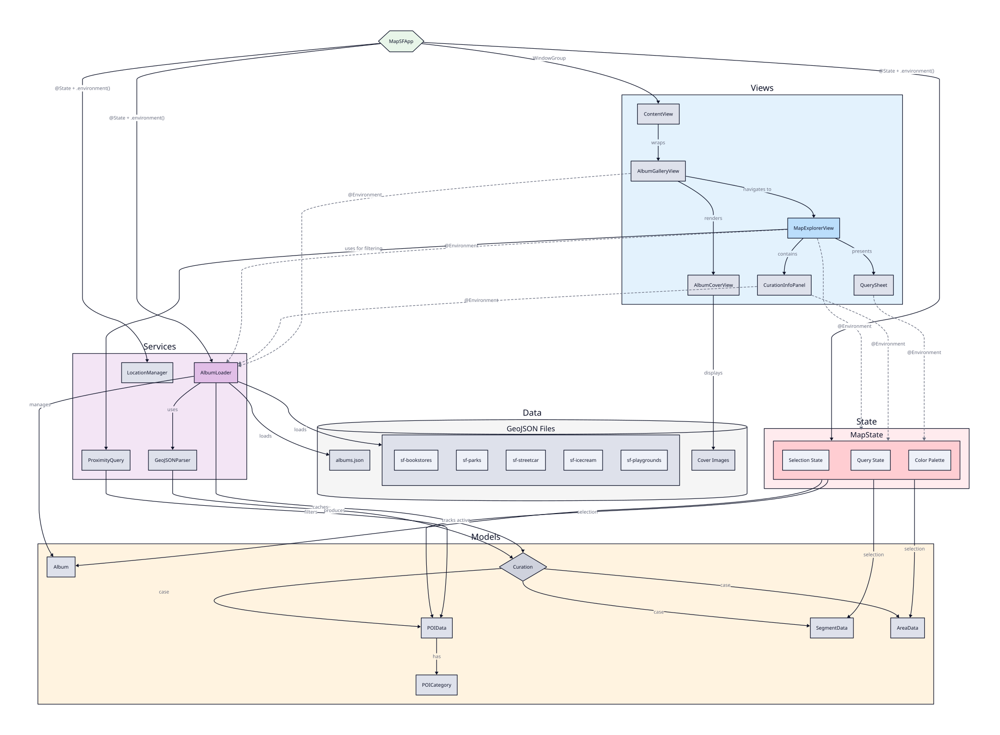

# MapSF


An offline-first iOS map explorer for San Francisco, featuring curated albums of places, routes, and areas with proximity-based discovery.

## Features

- **Offline Vector Tiles**: SF map tiles (z10-16) bundled with the app via MapLibre
- **Curated Albums**: Collections of POIs, walking routes (segments), and neighborhood areas
- **Proximity Queries**: Find nearby places based on current location or map center
- **Selection & Details**: Tap markers, routes, or areas to view details in the info panel
- **Color-Coded Overlays**: Each active album gets a distinct color for its markers and routes

## Tech Stack

- **SwiftUI** - Declarative UI with `@Observable` state management
- **MapLibre Native** - OpenGL-based vector map rendering with offline mbtiles support
- **GeoJSON** - Album content stored as GeoJSON files with custom properties
- **Protomaps** - Vector tiles sourced from Protomaps basemap builds

## Architecture



### Layers

| Layer | Purpose |
|-------|---------|
| **Views** | SwiftUI views - gallery, map explorer, info panel, query sheet |
| **State** | `MapState` - selection state, active albums, query filters |
| **Services** | `AlbumLoader`, `GeoJSONParser`, `LocationManager`, `ProximityQuery` |
| **Models** | `Album`, `Curation` (POI/Segment/Area), `POICategory` |
| **Data** | Bundled JSON albums, GeoJSON files, cover images, mbtiles |

### Data Flow

1. `MapSFApp` injects `AlbumLoader`, `MapState`, and `LocationManager` via SwiftUI environment
2. `AlbumLoader` parses `albums.json` and lazily loads GeoJSON content
3. `MapExplorerView` renders overlays based on `MapState.activeAlbums`
4. User taps propagate through `MapState` selection, updating the info panel
5. `ProximityQuery` filters POIs by distance from query center

## Project Structure

```
MapSF/
├── MapSFApp.swift          # App entry, environment setup
├── ContentView.swift       # Root view
├── Views/
│   ├── AlbumGalleryView    # Album grid with covers
│   ├── MapExplorerView     # Map + info panel + query sheet
│   ├── MapLibreMapView     # UIViewRepresentable for MLNMapView
│   ├── CurationInfoPanel   # Selected item details
│   └── QuerySheet          # Proximity query UI
├── Models/
│   ├── Album               # Album metadata
│   ├── Curation            # POI/Segment/Area enum
│   └── POICategory         # Category with icon mapping
├── Services/
│   ├── AlbumLoader         # Album & GeoJSON loading
│   ├── GeoJSONParser       # GeoJSON to model conversion
│   └── ProximityQuery      # Distance-based filtering
├── State/
│   └── MapState            # Observable selection & query state
├── Data/
│   ├── albums.json         # Album definitions
│   └── *.geojson           # Album content files
└── Resources/
    └── BaseMap/
        └── sf-tiles.mbtiles  # Offline vector tiles
```

## Tile Management

Update bundled tiles with the provided script:

```bash
./scripts/update-tiles.sh [YYYYMMDD]
```

Requirements: `pmtiles` CLI, `tippecanoe` (for `tile-join`), `sqlite3`

The script extracts SF region from Protomaps world basemap with two passes:
- z10-12: Wide coverage (natural tile grid extends beyond SF)
- z13-15: SF-focused coverage

## Building

1. Open `MapSF.xcodeproj` in Xcode 15+
2. Build and run on iOS 17+ device or simulator

MapLibre is fetched automatically via Swift Package Manager.

## License

Private project.
