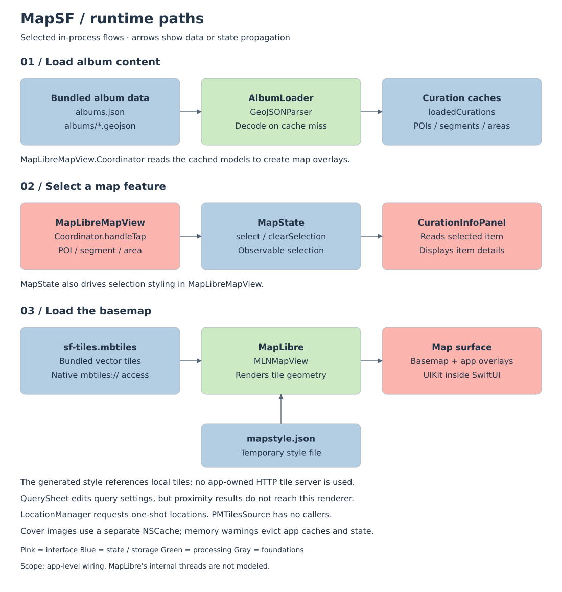

# MapSF


An offline-first iOS map explorer for San Francisco, featuring curated albums of places, routes, and areas with proximity-based discovery.

## Features

- **Offline Vector Tiles**: SF map tiles (z10-16) bundled with the app via MapLibre
- **Curated Albums**: Collections of POIs, walking routes (segments), and neighborhood areas
- **Proximity Queries**: Find nearby places based on current location or map center
- **Selection & Details**: Tap markers, routes, or areas to view details in the info panel
- **Color-Coded Overlays**: Each active album gets a distinct color for its markers and routes

## Tech Stack

- **SwiftUI** - Declarative UI with `@Observable` state management
- **MapLibre Native** - OpenGL-based vector map rendering with offline mbtiles support
- **GeoJSON** - Album content stored as GeoJSON files with custom properties
- **Protomaps** - Vector tiles sourced from Protomaps basemap builds

## Architecture


MapSF ships one iOS app target. Its Swift source groups contain the UI,
observable state, services, and data models; MapLibre is the linked Swift package
product. Albums, GeoJSON, covers, and MBTiles are bundled with the app. These
folders are organizational groups, not separate modules or strict dependency layers.



1. `MapSFApp` injects `AlbumLoader`, `MapState`, and `LocationManager` through the
   SwiftUI environment. `ContentView` shows the gallery and launch splash; choosing
   an album opens `MapExplorerView`.
2. `AlbumLoader` decodes `albums.json`, then lazily parses GeoJSON with
   `GeoJSONParser`. It caches curations and typed POI, segment, and area arrays.
   `MapLibreMapView.Coordinator` reads these models to build overlays.
3. Map taps update `MapState`; `CurationInfoPanel` reads the selection and the map
   updates its selection styling.
4. `MapLibreMapView` writes a temporary `mapstyle.json`. MapLibre loads that style
   and reads bundled `sf-tiles.mbtiles` through native `mbtiles://` access.
   The bundled `style.json` is not used by this path. The generated style declares
   a remote glyph URL, although its current layers contain no text symbols.
5. `QuerySheet` edits query settings. `ProximityQuery` exists, but
   `MapExplorerView.insidePOIIds` is not consumed and the active MapLibre renderer
   does not apply those results. `LocationManager` requests one-shot locations;
   the PMTiles helper has no callers.
6. Covers use a separate `NSCache`. Memory warnings clear album caches, cover
   caches, and map state; leaving the explorer also clears state and evicts the
   initial album's cached content.

Regenerate both diagrams with Python 3 (standard library only):

```bash
python3 scripts/generate-architecture.py
python3 scripts/generate-architecture.py --check
```

The generator derives source membership from the Xcode project and checks runtime
claims against Swift source. CI rejects stale SVGs. See the
[diagram maintenance notes](docs/architecture.md) for scope, checks, and review guidance.

## Project Structure

```
MapSF/
├── MapSFApp.swift          # App entry, environment setup
├── ContentView.swift       # Root view
├── Views/
│   ├── AlbumGalleryView    # Album grid with covers
│   ├── MapExplorerView     # Map + info panel + query sheet
│   ├── MapLibreMapView     # UIViewRepresentable for MLNMapView
│   ├── CurationInfoPanel   # Selected item details
│   └── QuerySheet          # Proximity query UI
├── Models/
│   ├── Album               # Album metadata
│   ├── Curation            # POI/Segment/Area enum
│   └── POICategory         # Category with icon mapping
├── Services/
│   ├── AlbumLoader         # Album & GeoJSON loading
│   ├── GeoJSONParser       # GeoJSON to model conversion
│   └── ProximityQuery      # Distance-based filtering
├── State/
│   └── MapState            # Observable selection & query state
├── Data/
│   ├── albums.json         # Album definitions
│   └── *.geojson           # Album content files
└── Resources/
    └── BaseMap/
        └── sf-tiles.mbtiles  # Offline vector tiles
```

## Tile Management

Update bundled tiles with the provided script:

```bash
./scripts/update-tiles.sh [YYYYMMDD]
```

Requirements: `pmtiles` CLI, `tippecanoe` (for `tile-join`), `sqlite3`

The script extracts SF region from Protomaps world basemap with two passes:
- z10-12: Wide coverage (natural tile grid extends beyond SF)
- z13-15: SF-focused coverage

## Building

1. Open `MapSF.xcodeproj` in Xcode 15+
2. Build and run on iOS 17+ device or simulator

MapLibre is fetched automatically via Swift Package Manager.

## License

Private project.
