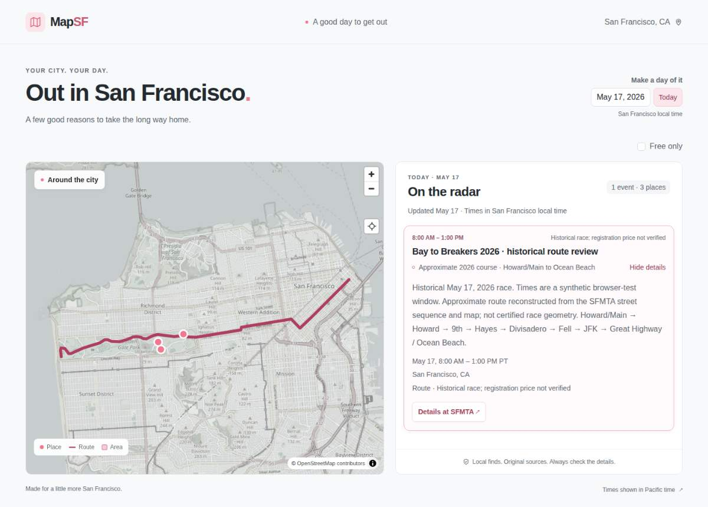

# Historical Bay to Breakers rendering review

Reviewed September 6, 2026 using the May 17, 2026 race as an isolated browser fixture. No historical event was added to the public event feed.

The [SFMTA May 17, 2026 service advisory](https://www.sfmta.com/project-updates/bay-breakers-service-impacts) explicitly identifies that race date and describes Howard/Main → Howard → Ninth → Hayes → Divisadero → Fell → Golden Gate Park → JFK → Ocean Beach / Great Highway. Its [western race map](https://www.sfmta.com/files/styles/constrain/public/images/2026-05/GGP.jpeg?itok=Ut90yGA-) provides the park curves. The organizer's current course page had rolled forward to 2027, so it was not used as evidence of the 2026 course.

`e2e/bay-to-breakers-fixture.mjs` contains a 61-vertex manual approximation of this sequence and park alignment. It is not certified race geometry, surveyed street alignment, a GPS recording, or a navigation aid. Street-geometry retrieval attempts did not yield usable data. The 08:00–13:00 event window is synthetic because the existing event schema requires both instants; this limitation appears in the visible event description. Only the race date and described route sequence are source-verified. Price is explicitly unverified.

Verification uses the built production renderer and real OpenStreetMap raster tiles, with only `/events.json` intercepted and the browser clock set to May 17. Clicking the initially expanded card closed and reopened it, exercising route bounds fitting. The test then examines actual canvas screenshot pixels, checks map-edge padding and citywide horizontal span, closes the card, and clicks a detected route interior pixel to reopen the matching details and source link. Pixel connectivity allows gaps up to 22px because the production place markers and their white borders render above the route near the Conservatory. This verifies visible continuity at screen scale, not geographic accuracy.

Final result: **2 passed (3.8s)**, desktop 1440×1000 and mobile 390×844. Visual inspection of both screenshots confirmed a continuous visible route from downtown through Golden Gate Park to the ocean, with endpoints inside the map, readable details, source link, and no horizontal page overflow. The existing nearby place markers partially obscure small portions of the route.

| Evidence | Desktop | Mobile |
| --- | --- | --- |
| Canvas size | 727×636 | 348×329 |
| Connected dark route pixels | 3,402 | 1,059 |
| Route horizontal extent | x=67…658 | x=68…280 |
| Route vertical extent | y=236…398 | y=135…194 |
| Full-page screenshot | `/tmp/bay-to-breakers-desktop.png` | `/tmp/bay-to-breakers-mobile.png` |
| Pixel measurements | `/tmp/bay-to-breakers-desktop-pixels.json` | `/tmp/bay-to-breakers-mobile-pixels.json` |

Reproduce from the repository root after `pnpm run build` (the Playwright config starts/reuses port 4332):

```sh
PLAYWRIGHT_BROWSERS_PATH=/tmp/mapsf-playwright pnpm exec playwright test e2e/bay-to-breakers.spec.mjs
```

Automated tests always substitute local tiles and cannot opt into the community tile service. The earlier visual review image is retained as an artifact; future live-basemap inspection should use normal human browsing. The recorded screenshots and results above used real tiles. The test never adds application globals, exposes the map instance, or alters production renderer code.

Saved review image (live basemap):


