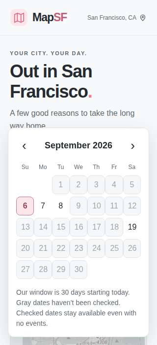

# Checked-date calendar and route verification

Implement an explicit 30-day Pacific window, today through day 29. Coverage records approved publisher dates actually checked, including empty/rejected results; never infer coverage from a date span or recurring gardens. Preserve prior coverage on HTTP failure and fresh coverage after completed collection with validation failures. Skip clearly out-of-window adapter detail requests and exclude events wholly outside the window.

Replace the native date input with an accessible popover calendar showing disabled gray unchecked days and enabled checked-empty days. Support keyboard activation, Escape, narrow screens, stable focus during minute refreshes, and explicit missing coverage. Keep the existing Today/free controls.

Verify a historical Bay to Breakers route as a browser-only, explicitly approximate reconstruction. Save desktop/mobile renderer evidence, and use local tiles by default in CI. Diagnose Valencia LIVE separately and document authoritative date-specific boundaries and city centerline data for owner source review.

Completed verification: 70 unit tests; 13 production browser checks; architecture freshness; whitespace checks; live source refresh; calendar/mobile and historical route visual inspection. Review found validation-only coverage loss and calendar focus loss; both fixed with regressions.

